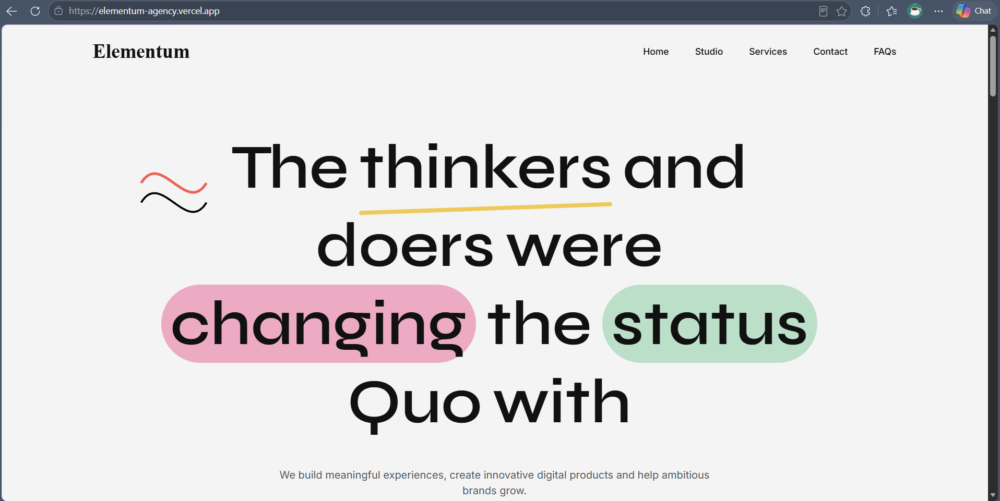
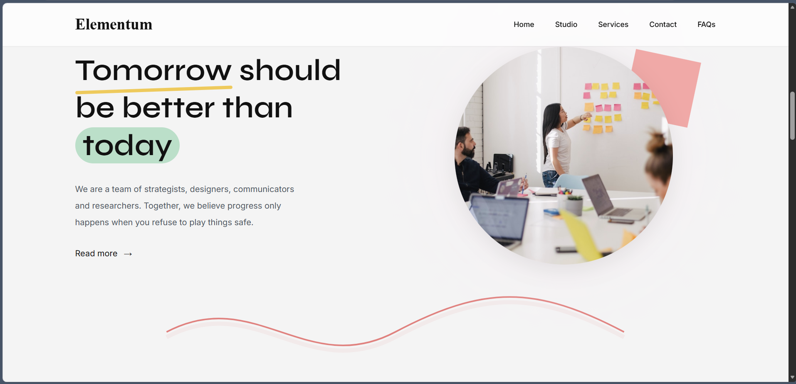
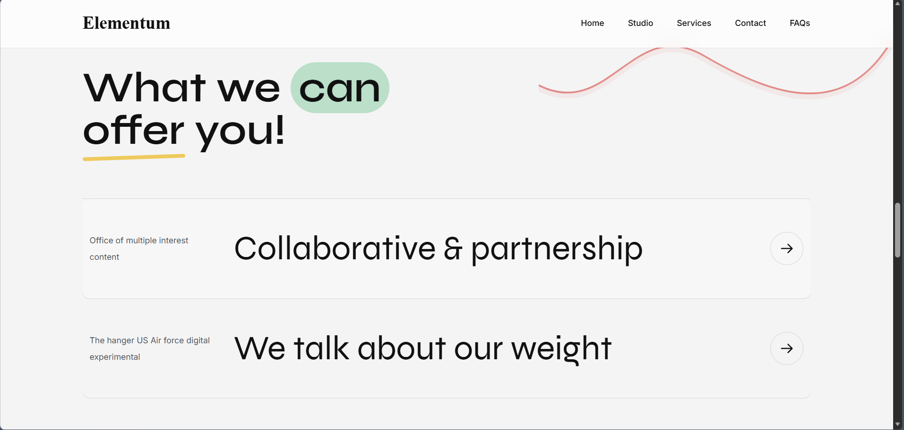
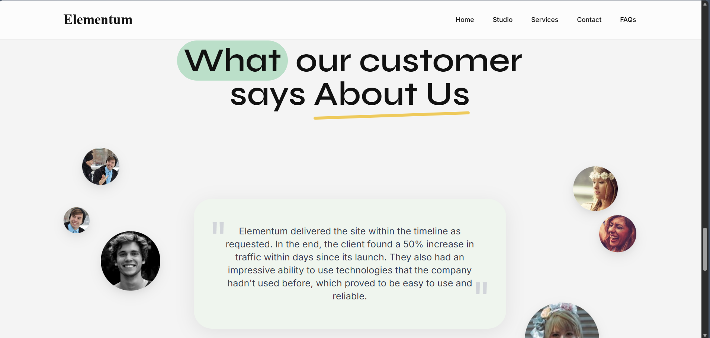
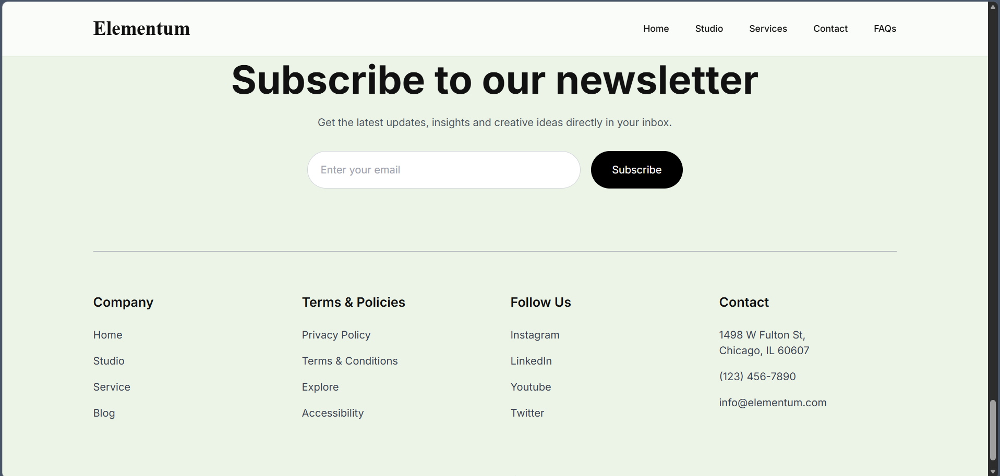

# Elementum – Creative Agency Landing Page

A modern, responsive creative agency landing page built with **React, Vite, Tailwind CSS, and Framer Motion**.

This project was developed as part of a frontend internship assignment focused on:

* Pixel-perfect UI implementation
* Responsive design
* Clean component architecture
* Animations and interactions
* Modern React development practices

---

## 🚀 Live Demo

🔗 **Live Website:** https://elementum-agency.vercel.app

🔗 **GitHub Repository:** https://github.com/subhava06/Trams_Assignment

---

## 📸 Screenshots

### Hero Section



---

### About Section



---

### Services Section



---

### Testimonials Section



---

### Newsletter Section



---

### Footer Section


---

## ✨ Features

### Responsive Design

* Mobile First
* Tablet Optimized
* Desktop Optimized

### Modern UI

* Creative agency landing page
* Custom highlights
* Decorative SVG elements
* Modern typography

### Animations

* Hero text stagger animations
* Scroll-triggered section animations
* Floating avatars
* Hover interactions
* Smooth transitions

### Reusable Components

* Navbar
* Hero
* About
* Services
* Testimonials
* Newsletter
* Footer

---

## 🛠️ Tech Stack

### Frontend

* React
* Vite
* Tailwind CSS
* Framer Motion

### Deployment

* Vercel

### Version Control

* Git
* GitHub

---

## 📁 Project Structure

```bash
src/
│
├── components/
│   ├── Navbar.jsx
│   ├── Hero.jsx
│   ├── About.jsx
│   ├── Services.jsx
│   ├── Testimonials.jsx
│   ├── Newsletter.jsx
│   └── Footer.jsx
│
├── App.jsx
├── main.jsx
└── index.css
```

---

## ⚙️ Installation

Clone the repository:

```bash
git clone https://github.com/subhava06/Trams_Assignment.git
```

Move into the project:

```bash
cd Trams_Assignment
```

Install dependencies:

```bash
npm install
```

Start development server:

```bash
npm run dev
```

---

## 📦 Build for Production

```bash
npm run build
```

Preview production build:

```bash
npm run preview
```

---

## 🌐 Deployment

The project is deployed on Vercel.

```bash
vercel
```

Production deployment:

```bash
vercel --prod
```

---

## 🎯 Assignment Objectives Covered

* Responsive UI Development
* React Component Architecture
* Tailwind CSS Styling
* Framer Motion Animations
* Accessibility Considerations
* Clean Project Structure
* Deployment to Production

---

## 👨‍💻 Author

**Subhava Ojha**

Frontend Developer | Flutter Developer | React Learner

GitHub: https://github.com/subhava06

---

## 📄 License

This project is intended for educational and evaluation purposes.
